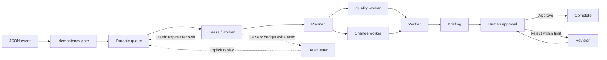

# OpsCheck Flow

A local-first durable workflow runner for checking operational CSV exports, recovering interrupted work, and recording human approval.

[](https://github.com/MasterAerol/opscheck-flow/actions/workflows/ci.yml)
[](pyproject.toml)
[](LICENSE)

A team receives another orders export. Before acting on it, someone needs to check missing values, compare changed records, verify the findings, and approve a briefing. OpsCheck makes that sequence durable across retries, duplicate submissions, process crashes, and human revisions. The default runs on the **Python standard library and SQLite**, with no third-party runtime dependencies or paid services.



[Architecture](docs/ARCHITECTURE.md) · [Portfolio](docs/PORTFOLIO.md) · [Demo guide](docs/DEMO_GUIDE.md) · [Interview guide](docs/INTERVIEW_GUIDE.md) · [Validation](docs/VALIDATION.md)

## Why OpsCheck Flow?

The useful unit of work is the whole review lifecycle: parallel data checks, verified evidence, a briefing, and a recorded human decision. A retry should reuse completed checks. A repeated export should find its existing run. A worker crash should leave enough state for recovery, and a rejected briefing should return for review without repeating the data checks.

The **planner, quality worker, change worker, verifier, local briefing, and human revision logic are deterministic Python**. Only the optional analyst and reviewer use a model. Their review loop cannot grant human approval. This is an inspectable orchestration project using synthetic operational data; no production adoption or measured business savings are claimed.

## Patterns implemented

| Pattern | Implementation | Why it matters here |
| --- | --- | --- |
| Parallel work | Fixed DAG and `ThreadPoolExecutor` specialists | Quality and snapshot checks can overlap |
| Durable state and task retry | SQLite outputs, attempts, bounded retries and resume | Reuse committed work after interruption |
| Verification | Recompute results and check sources, structure and counts | Catch inconsistent workflow evidence |
| Human approval and revision | Persisted briefing versions and conditional decisions | Pause across process restarts; retain feedback |
| Event ingestion and idempotency | Strict manifests, content fingerprints, immutable aliases | Repeated input reuses one canonical event/run |
| Worker queue | Persistent jobs, atomic claims and run reservations | Enqueue now, execute later |
| Leases, heartbeats and fencing | Expiration plus token-checked renewal/settlement | Coordinate local workers and reject stale ownership |
| Crash recovery | Saved checkpoints and local OS execution locks | Resume the same run after a worker dies |
| Dead letters and replay | Delivery budget, backoff and retained attempt history | Stop repeated failures; allow explicit operator recovery |
| Optional AI review | Bounded analyst/reviewer loop over evidence IDs | Explore model-assisted briefings without requiring a model |

The verifier uses the same deterministic engines as the specialists; it is a consistency check, not an independent proof that those engines are correct.

## Quick start

Use Python 3.10+ from a source checkout. These examples use **Windows PowerShell and Python 3.12**. On Linux/macOS, use `python3 -m opscheck` and adapt the shell variable syntax. Source execution needs no installation. Every example uses synthetic bundled data and a unique state directory.

### Direct workflow

```powershell
$directState = ".opscheck/direct-demo-" + [guid]::NewGuid().ToString("N")
py -3.12 -m opscheck flow-demo --state-dir $directState
$directRun = py -3.12 -m opscheck runs --state-dir $directState | ConvertFrom-Json
# Review the briefing in the printed report before approving.
py -3.12 -m opscheck approve $directRun.run_id --reviewer "Aerol" --state-dir $directState
Invoke-Item "$directState/$($directRun.run_id)/report.html"
```

The first command reaches `WAITING_FOR_APPROVAL`; approval reaches `SUCCEEDED`. Data-quality findings are expected in the messy fixture. Workflow success means the checks and human review completed, not that the source data is clean.

### Queued workflow

```powershell
$state = ".opscheck/queue-demo-" + [guid]::NewGuid().ToString("N")
$job = py -3.12 -m opscheck enqueue opscheck/examples/inbox/job-001.opscheck.json --state-dir $state | ConvertFrom-Json
$job | Select-Object id, ingestion_id, workflow_run_id, status, attempts
py -3.12 -m opscheck runs --state-dir $state
# Empty: enqueue reserved a run ID but executed no workflow.

$duplicate = py -3.12 -m opscheck enqueue opscheck/examples/inbox/job-001.opscheck.json --state-dir $state | ConvertFrom-Json
$duplicate | Select-Object id, workflow_run_id, duplicate, job_created
# Same job/run; duplicate=True, job_created=False.

py -3.12 -m opscheck worker --once --worker-id demo-worker --state-dir $state
py -3.12 -m opscheck job $job.id --state-dir $state
# WAITING_FOR_APPROVAL. Review the printed briefing/report, then approve.
py -3.12 -m opscheck approve $job.workflow_run_id --reviewer "Aerol" --state-dir $state
py -3.12 -m opscheck queue --state-dir $state
py -3.12 -m opscheck event $job.ingestion_id --state-dir $state
Invoke-Item "$state/$($job.workflow_run_id)/report.html"
```

Final states: queue `SUCCEEDED`, event `COMPLETED`, workflow `SUCCEEDED`. Use the same `--state-dir` on every related command. The [demo guide](docs/DEMO_GUIDE.md) adds rejection, deterministic revision, and reapproval to this lifecycle. The [CLI guide](docs/CLI_GUIDE.md) covers your own files, manifest rules, synchronous `ingest`, scanning, inspection, optional models, and exit codes.

## See failure recovery

Make one task fail on its first attempt, then retry successfully:

```powershell
$retryState = ".opscheck/retry-demo-" + [guid]::NewGuid().ToString("N")
py -3.12 -m opscheck flow-demo --fail-once quality_agent --state-dir $retryState
```

The quality task finishes on attempt 2 and the workflow pauses for approval. Task retries and queue delivery retries have separate budgets. To see a queue delivery exhaust its budget, retain a dead letter, and replay the **same job/event/run**, follow the short [dead-letter demo](docs/DEMO_GUIDE.md#dead-letter-and-replay-demo).

## Reliability model

Within **one shared local SQLite state store**, OpsCheck provides durable workflow/event/queue state, at most one canonical workflow per event fingerprint, atomic claims, lease-token fencing, heartbeat renewal, reuse of completed tasks, persisted approval history, and retained dead-letter/replay history.

An **unexpired lease belongs to its token holder**. Inspection and another worker's polling cannot settle it. After expiration, a saved approval/success checkpoint is reconciled before charging an incomplete delivery as expired. Recovery preserves the reserved run ID; a task interrupted before its result commits may execute again.

These guarantees assume a local filesystem and a sufficiently consistent local clock. They do not include distributed consensus, multi-region operation, independent-machine coordination, network-filesystem correctness, or globally exactly-once execution. See the [failure/recovery table](docs/ARCHITECTURE.md#crash-recovery) and [lease model](docs/ARCHITECTURE.md#lease-and-fencing-model).

## Project structure

| Module | Purpose |
| --- | --- |
| `core.py` | Deterministic CSV validation and keyed comparison |
| `workflow.py` | DAG, parallel tasks, persisted execution and resume |
| `approvals.py`, `revision.py` | Human decisions and bounded clarification |
| `manifests.py` | Strict JSON and content identity |
| `ingestion.py`, `event_store.py` | Receipt, duplicates and event/run linkage |
| `queue.py`, `queue_store.py` | Durable jobs, claims, fencing and attempt history |
| `worker.py` | Delivery execution and heartbeat lifecycle |
| `agents.py` | Optional analyst/reviewer model adapter |
| `report.py`, `artifacts.py` | Escaped reports and protected atomic file writes |
| `cli.py` | Commands, inspection and packaged demos |

Modules live under [opscheck/](opscheck/). [tests/](tests/) covers engine, CLI, persistence, concurrency, recovery, and model-adapter behavior.

## Tests and CI

```powershell
py -3.12 -m unittest discover -s tests -v
py -3.12 -m opscheck --version
```

[GitHub Actions](https://github.com/MasterAerol/opscheck-flow/actions/workflows/ci.yml) is the source for current hosted CI status. The [workflow](.github/workflows/ci.yml) runs the full unit/integration suite on Ubuntu with Python **3.10, 3.12, and 3.14**, and Windows with Python **3.12**. Each job builds/installs with pip and runs the installed-package smoke outside the checkout. Separate local packaging QA builds both the source distribution and wheel, then installs the wheel into a clean environment.

See the [latest local validation snapshot](docs/VALIDATION.md#portfolio-polish-validation) for actual results and the [contribution guide](CONTRIBUTING.md) for setup. Model adapter tests use a local fake HTTP server; this pass did not exercise a live model.

## Safety and limitations

Strict JSON manifests cannot select code, `eval`, dynamic imports, or shell commands. Source paths must remain within the manifest directory. Bounded inputs, state/input overwrite guards, implemented symlink/hardlink alias checks, HTML escaping, SQLite transactions, and lease guards define the existing boundaries. This is not formally audited security software; read [SECURITY.md](SECURITY.md).

The project is local-first, uses one shared SQLite store, and has no network queue server, hosted SaaS, authenticated reviewer accounts, or distributed consensus. Reviewer names are asserted local metadata. CSV processing is in memory with documented size limits. Deterministic revision performs bounded clarification using saved evidence; it cannot repair source data or fulfill arbitrary editorial requests. The optional live model server is unnecessary for the default flow and has no tool-execution authority. No real-customer production reliability is claimed.

## Documentation and contributing

- [Architecture](docs/ARCHITECTURE.md): transactions, state machines, fencing and recovery.
- [Portfolio summary](docs/PORTFOLIO.md): decisions, resume bullets and project explanation.
- [Demo guide](docs/DEMO_GUIDE.md) and [interview guide](docs/INTERVIEW_GUIDE.md): show and explain the implementation.
- [CLI guide](docs/CLI_GUIDE.md): detailed command contracts and input semantics.
- [Project journey](docs/PROJECT_JOURNEY.md) and [learning guide](docs/LEARNING.md): milestones and study path.
- [Validation](docs/VALIDATION.md): dated local evidence; historical [Milestone 4 PR notes](docs/MILESTONE4_PR.md) are retained.
- [Changelog](CHANGELOG.md), [proposed release notes](docs/RELEASE_NOTES.md), and [contributing](CONTRIBUTING.md).

## License

[MIT](LICENSE).
