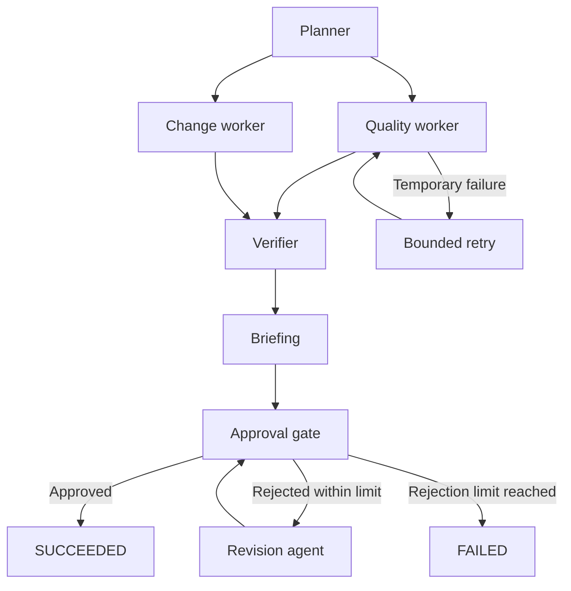

# OpsCheck Flow

**A local workflow runner that checks CSV exports, compares changes, verifies its work, and produces an operations briefing.**

OpsCheck Flow is a small, inspectable Python project for learning workflow orchestration and agent systems through a concrete operations task. An operator receives a new orders export: are required fields missing, which records changed, and what should someone review first? OpsCheck runs the checks in parallel, verifies the evidence, records each task attempt, and resumes interrupted work from local state.

The default workflow runs with **Python 3.10+ and zero third-party runtime dependencies**. It requires no paid API, account, hosted service, or model download. An optional local model mode adds separate analyst and reviewer subagents with a bounded revision loop. The deterministic workers in the default demo are Python tasks, not LLM agents.

**Status:** v0.1.0, a local CLI and Python library. The project includes synthetic data, tests, contribution templates, and a CI configuration. It does not claim production users or a live hosted deployment.

**Included demo:** [docs/demo/report.html](docs/demo/report.html) is the original Milestone 1 snapshot. Run `py -3.12 -m opscheck flow-demo` to generate the current human approval workflow. See [the validation record](docs/VALIDATION.md) for executed checks and platform limits.

## Try the complete workflow

From the project directory:

```bash
python -m opscheck flow-demo
```

On systems where Python 3 is named `python3`, substitute `python3` throughout. The command prints the run ID, task states, attempts, and report locations. Open the printed `report.html` path for the workflow dashboard. Local execution state is stored under `.opscheck/runs/` by default; each run has `report.json`, `report.html`, `quality.html`, and `changes.html` when its tool results are available.

To make recovery visible, inject one temporary failure:

```bash
python -m opscheck flow-demo --fail-once quality_agent
python -m opscheck runs
```

The quality worker fails on its first attempt, retries within the configured limit, and then succeeds. The independent comparison worker can complete while this happens. Inspect the run's ordered events and attempt counts to see the recovery.

Run `python -m opscheck flow-demo --resume RUN_ID` with a printed demo ID to inspect its saved checkpoint. A pending approval remains paused; use `approve` or `reject` to submit a human decision.

The bundled example contains 10 synthetic orders. Its quality check finds 8 issues across 8 records. The comparison finds 1 added order, 1 removed order, 2 modified orders, and 7 unchanged orders. A successful workflow can contain data-quality findings: success means the pipeline completed, verified its results, and received human approval.

## What the workflow does



| Role | Responsibility | Implementation |
| --- | --- | --- |
| Planner | Declare dependencies before execution | A fixed, explicit task plan |
| Quality worker | Apply a JSON rule set to a CSV export | Deterministic Python validation |
| Change worker | Compare two CSV snapshots by a stable key | Deterministic Python comparison |
| Verifier | Check result structure, counts, sources, and recomputed results | A separate deterministic verification step |
| Briefing | Summarize verified evidence | Deterministic by default; optional analyst/reviewer model team |
| Approval gate | Persist the human decision boundary | SQLite checkpoint; process exits normally |
| Revision agent | Clarify the briefing using feedback and verified findings | Deterministic record-level details; no model required |

SQLite stores task states, attempts, outputs, and an event history. Successful tasks are reused on resume. Input contents and relevant configuration are fingerprinted so a resumed run cannot silently mix old and new inputs. The verifier reruns the same engines; it checks consistency and orchestration integrity, not correctness through an independently developed algorithm.

## Run it on your files

The following single-line command also works from a source checkout:

```bash
python -m opscheck flow opscheck/examples/orders-messy.csv --rules opscheck/examples/rules.json --before opscheck/examples/orders-before.csv --after opscheck/examples/orders-after.csv --key order_id --json reports/flow.json
```

To resume that run, repeat the same input and configuration options and add `--resume` with the run ID printed by the first command:

```bash
python -m opscheck flow opscheck/examples/orders-messy.csv --rules opscheck/examples/rules.json --before opscheck/examples/orders-before.csv --after opscheck/examples/orders-after.csv --key order_id --resume RUN_ID --json reports/flow.json
```

Replace `RUN_ID` with an existing ID; it is not a literal example run. Use `--state-dir PATH` consistently if you change the state location. `--max-attempts` accepts 1–5 and defaults to 2. This is an allowance per task for the current invocation; accumulated attempt counts remain visible across resumed invocations. Invalid CSV or rule configuration is not a temporary failure and is not retried automatically.

For a repeatable failed-run demonstration, run the first command with `--fail-once quality_agent --max-attempts 1`. Resume it with the same input/configuration options and `--resume RUN_ID`. The injected failure applies only to the task's first lifetime attempt.

## Human-in-the-Loop Workflows

The briefing is a durable human checkpoint. OpsCheck saves a pending approval and its exact briefing in SQLite, marks the run `WAITING_FOR_APPROVAL`, writes the reports, and exits with code `0`. The engine never calls `input()` or keeps a terminal waiting. You can close PowerShell or restart the computer, then decide using the same state directory.

Run states are `PENDING`, `RUNNING`, `WAITING_FOR_APPROVAL`, `SUCCEEDED`, and `FAILED`. Task states remain separate and lowercase. Neither completing the workers nor obtaining optional model reviewer approval satisfies the human requirement.

Complete Windows PowerShell example (substitute the printed run ID):

```powershell
# 1. Create a briefing. Expected: WAITING_FOR_APPROVAL.
py -3.12 -m opscheck flow-demo
$runId = 'PASTE_PRINTED_RUN_ID'
py -3.12 -m opscheck run $runId

# 2. Request a revision. Expected: revision_agent completes, WAITING_FOR_APPROVAL.
py -3.12 -m opscheck reject $runId --reviewer "Aerol" --comment "Please make the change summary clearer."

# 3. Inspect SQLite history. Expected: #1 REJECTED, #2 PENDING.
py -3.12 -m opscheck approvals $runId

# 4. Approve the revised briefing. Expected: SUCCEEDED.
py -3.12 -m opscheck approve $runId --reviewer "Aerol"
py -3.12 -m opscheck run $runId
Start-Process ".opscheck/runs/$runId/report.html"
```

Use `python` or `python3` instead of `py -3.12` on Linux. Pass `--state-dir PATH` to **every** command if you use a custom state directory. `approve` accepts optional `--reviewer` and `--comment`; `reject` requires a nonblank `--comment`. An omitted reviewer is stored as unspecified; this local CLI does not authenticate identities.

Each rejection preserves the prior request, reviewer, comment, timestamps, and exact briefing snapshot. The revision agent reads saved verifier and worker results, emphasizes validation or snapshot changes according to the feedback, and adds row/ID details, issue types, values, explanations, and before/after changes. It never edits CSVs or executes feedback as instructions. Local revision also works for an initially model-assisted briefing and makes no further model calls. Arbitrary editorial requests may require human editing outside this deterministic scope.

Every revision creates a **new** pending approval. `--max-human-revisions 3` (the default) allows three rejected versions total: reject v1 → v2, reject v2 → v3, reject v3 → `FAILED`. This counts rejected versions, including the original briefing; it permits at most two revisions. The configurable range is 1–20, saved with the run and immutable on resume. Limit exhaustion saves a failure reason and a `revision_limit_reached` event; resume cannot reset this budget.

`run RUN_ID` shows status, active approval ID, iteration, rejection count, and report location. `approvals RUN_ID` reads immutable history from SQLite, not from report files. Each `briefing-vN.json` is a disposable copy of the exact snapshot held in the database. `report.html` shows current approval status and escaped history; reviewer names and comments display as text even when they contain HTML.

For delayed or automated clients, pass `--approval-id APPROVAL_ID` from `run` to decide only the exact version reviewed. The printed approve/reject commands include it. Without it, a command targets the pending version it observes when it starts reading state. Concurrent attempts for the same version cannot both succeed; a losing command reports an already executing/completed run or no pending approval. Never retry a decision against a newer version without reviewing it.

Use `py -3.12 -m opscheck resume RUN_ID` to recover an interrupted process using saved configuration. Completed specialists are reused. Pending approval remains paused; a decision committed just before a crash resumes from that decision, and a saved revision output is reused without generating another revision. Once a briefing exists, approval and revision use its persisted evidence even if original inputs have moved. Starting or resuming unfinished data checks still requires unchanged input paths, content, and configuration. Existing `flow --resume` and `flow-demo --resume` keep their input fingerprint checks.

Reports are derived artifacts. If a report write fails after a decision commits, the decision remains saved; resolve the filesystem problem and run `resume RUN_ID` to regenerate reports. Do not resubmit the decision. SQLite connections close explicitly, and OS locks release on process exit, including crashes.

## Event-Triggered Workflows

An inbox job manifest starts the same durable workflow used by `flow` and `flow-demo`. Ingestion has its own SQLite event record, audit history, content identity, and reserved workflow ID. Replaying an event reuses its canonical run, including its existing human approval history.

Try the packaged synthetic inbox from a source checkout:

```powershell
py -3.12 -m opscheck ingest opscheck/examples/inbox/job-001.opscheck.json
py -3.12 -m opscheck events

# Replace these with the Event and Run values printed above.
$eventId = 'PASTE_EVENT_ID'
$runId = 'PASTE_RUN_ID'
py -3.12 -m opscheck event $eventId

# Expected: Duplicate event detected; same event and run.
py -3.12 -m opscheck ingest opscheck/examples/inbox/job-001.opscheck.json

# Existing human approval commands continue to apply.
py -3.12 -m opscheck reject $runId --reviewer "Aerol" --comment "Explain changed records."
py -3.12 -m opscheck approve $runId --reviewer "Aerol"
py -3.12 -m opscheck event $eventId
# Expected: Status: COMPLETED

# One-shot inbox processing; repeated scans create no duplicate runs.
py -3.12 -m opscheck scan opscheck/examples/inbox
py -3.12 -m opscheck scan opscheck/examples/inbox
```

Use `--state-dir PATH` consistently on ingestion, scanning, inspection, retry, and human decision commands when you want a separate store. On Linux, use `python3` instead of `py -3.12`. The demo inbox lives under `opscheck/examples/` so its manifest and synthetic data can also ship in the wheel. The installed-package smoke test copies those resources into a temporary inbox; it does not depend on checkout files.

### Manifest contract

```json
{
  "event_type": "orders_check",
  "input": "data/orders-messy.csv",
  "rules": "data/rules.json",
  "before": "data/orders-before.csv",
  "after": "data/orders-after.csv",
  "key": "order_id",
  "event_id": "customer-import-2026-09-15-001"
}
```

The first five fields are required. `key` defaults to `order_id`; `event_id` is optional. All fields must be nonblank strings. Only `orders_check` is supported. Unknown fields, duplicate JSON keys, nonstandard numeric constants, malformed JSON, and invalid paths are rejected. A manifest is limited to 64 KiB, each source file to 10 MiB, and the key/external event ID to 256 characters. There are no dynamic imports, shell commands, model endpoints, or executable expressions in this format.

Paths are relative to the manifest's directory, with Windows or forward-slash separators accepted. Resolved sources must be regular files beneath that directory. Absolute/drive paths, alternate data streams, and traversal or symlinks escaping the directory are rejected. Put shared data in a subdirectory of the inbox. Existing input, SQLite-sidecar, and lock-file protections still apply.

### Exact duplicate semantics

The fingerprint is SHA-256 over canonical JSON containing an identity-format version, event type, normalized comparison key, and SHA-256 hashes of the four source roles. It includes source bytes, including rule bytes; it excludes manifest filenames, source locations, JSON formatting, and external delivery IDs. Therefore renamed manifests, copied data directories, and equivalent manifest formatting resolve to the same canonical event. Changing a processing key or any source bytes produces a new fingerprint. Reformatting a rule file changes its bytes and therefore its fingerprint.

Every supplied external `event_id` is permanently bound to the canonical fingerprint in an alias table. Reusing it with identical content returns the existing event. Reusing it with different content creates an inspectable `INVALID` conflict record and creates no workflow. Different external IDs with identical job content become aliases of the same canonical event. Inspection lists all registered aliases.

SQLite unique constraints and a `BEGIN IMMEDIATE` transaction enforce identity across processes. A claim transaction reserves a run ID before execution; it can never be replaced. An OS-owned event lock spans processing, while the existing workflow lock protects execution. A concurrent duplicate returns saved state and never schedules a second run. If the first process has not yet committed its claim, that response may show `VALIDATED` and no run ID; inspect the event again for its committed reservation.

Duplicate submissions increment `duplicate_count` on the canonical event and append an audit entry containing their submission path. They do not create separate duplicate event rows. Invalid replays reuse a diagnostic identity derived from manifest location, a bounded raw-content hash, and the validation error; they remain `INVALID`. Correcting a manifest allows a valid canonical event to be created. Unsafe or unwritable state destinations may prevent durable error recording; the CLI reports the error without overwriting inputs.

### Scanning, recovery, and inspection

`scan` processes **only top-level `*.opscheck.json` entries**, sorted by filename. It is nonrecursive and one-shot. Plain `rules.json` files are not treated as jobs. Direct `ingest` accepts any JSON filename. Each manifest is processed independently, and the summary includes scanned entries, new events, duplicates, invalid entries, failures, and workflows created. A second scan normally reports zero workflows created. Invalid repeated submissions count as invalid entries, not successful duplicates. Watch mode is not implemented.

Valid events follow `RECEIVED → VALIDATED → CLAIMED → WORKFLOW_CREATED → WAITING_FOR_APPROVAL → COMPLETED`. Rejection keeps the linked run and its approval loop. Execution failures produce `FAILED`; validation failures produce `INVALID`. Run status remains authoritative for execution. Event/run inspection, workflow reporting, approval/rejection, and duplicate processing synchronize the event's derived status. Audit entries are appended only when status changes.

If processing crashes after receipt, claim, or run creation, re-ingest or rescan the unchanged job to recover the same reserved run. To explicitly retry a recoverable failure or interrupted event:

```powershell
py -3.12 -m opscheck retry-event $eventId
```

Failed jobs do not automatically retry on every scan. Retry reuses the reserved run and successful worker outputs. Before data checks complete, original inputs and settings must still match the fingerprint saved at receipt; if files changed, restore the original bytes to retry that event. New content without a reused external ID is a new logical event. Once the briefing is verified and saved, recovery uses Milestone 2's persisted briefing/revision state even if source files have moved.

`INVALID`, `COMPLETED`, and `WAITING_FOR_APPROVAL` events cannot be retried. Waiting events need the existing approve/reject commands. Human revision-limit failures are terminal and cannot be reset by event retry. A report-write failure does not undo a committed workflow decision; use the existing `resume RUN_ID` after fixing the filesystem issue to rebuild reports. The ingestion audit retains the recorded processing error.

`events` prints one JSON object per stored event, including ID, status, linked run, and duplicate count. `event EVENT_ID` shows configuration identity, source manifest, external aliases, timestamps, error, and ordered audit history. Arbitrary human/manifest strings are escaped in terminal output and HTML; manifests are not exposed as clickable arbitrary file links in reports.

This guarantees **at-most-one canonical workflow per event fingerprint within a shared local SQLite state store**. It is local durable coordination, not distributed exactly-once processing. Independent state directories have independent identities; network filesystems, cross-machine leases, authenticated event producers, and a background daemon are outside this milestone.

## Durable Worker Queue

`ingest` still executes a manifest immediately. `enqueue` validates the same manifest, persists/reuses its event, reserves its canonical run ID, and saves one queue job **without running specialists**. `scan INBOX --enqueue` queues an inbox without executing it; repeated scans report zero new queue jobs for known events. Queue commands print JSON, including `duplicate` and `job_created` on enqueue, so PowerShell can capture IDs directly.

```powershell
# Fresh isolated state; existing runs are not deleted.
$state = ".opscheck/queue-demo-" + [guid]::NewGuid().ToString("N")
$job = py -3.12 -m opscheck enqueue opscheck/examples/inbox/job-001.opscheck.json --state-dir $state | ConvertFrom-Json
py -3.12 -m opscheck queue --state-dir $state
py -3.12 -m opscheck runs --state-dir $state  # Empty: reservation is not an executed run.
py -3.12 -m opscheck worker --once --worker-id local-worker-1 --state-dir $state
py -3.12 -m opscheck job $job.id --state-dir $state  # WAITING_FOR_APPROVAL
py -3.12 -m opscheck approve $job.workflow_run_id --reviewer "Aerol" --state-dir $state
py -3.12 -m opscheck job $job.id --state-dir $state  # SUCCEEDED
py -3.12 -m opscheck event $job.ingestion_id --state-dir $state  # COMPLETED
```

A **lease** grants one worker temporary ownership of a delivery attempt. A serialized SQLite claim assigns a securely random token and UTC expiration. The worker renews its lease every one-third of the lease duration using a background thread with its own explicitly closed SQLite connections. Heartbeats update attempt timestamps without adding an audit row every time. Inspection redacts lease tokens. Worker names are diagnostic metadata, not authentication.

After a crash, an expired lease is recorded and another worker can claim the **same job, event, and reserved run**. The existing workflow lock prevents simultaneous workflow execution even if a lease is unexpectedly lost while the original process is alive. A worker encountering that lock defers for one second; its lifetime attempt remains recorded, but the deferral does not spend a failure-budget attempt. A stale token cannot heartbeat or settle delivery. A workflow already running when renewal fails may finish under its OS lock; the stale worker then refuses queue settlement. It cannot forcibly cancel already running Python specialists.

The first normal worker execution stops at `WAITING_FOR_APPROVAL` and clears the lease. CSV quality findings are successful delivery, not a reason to retry. Human rejection/revision uses the existing approval lifecycle and the same job; successful rejection/revision consumes no new queue attempt. Approval produces queue `SUCCEEDED`, event `COMPLETED`, and workflow `SUCCEEDED`. A failed revision can use queue recovery while retaining its immutable approval history; an exhausted human revision limit is non-replayable.

Worker modes and bounds:

```powershell
py -3.12 -m opscheck worker --once --lease-seconds 30
py -3.12 -m opscheck worker --worker-id local-worker-1 --poll-interval 2
py -3.12 -m opscheck worker --max-jobs 5 --poll-interval 0.5
py -3.12 -m opscheck scan opscheck/examples/inbox --enqueue
```

`--once` attempts one claim, processes it if available, and exits. The long-running mode polls when empty and exits cleanly on Ctrl+C. `--max-jobs` counts claims, including failed/deferred deliveries; when fewer jobs exist it continues polling until the limit or Ctrl+C. `--once` takes precedence if both are supplied. Lease duration is 5–3600 seconds; poll interval is 0.1–60 seconds; worker IDs are nonblank, at most 128 characters, with no control characters. Enqueue supports `--priority -100..100` (highest first, then oldest available) and `--max-attempts 1..10` (default 3). Duplicate enqueue does not reset priority or delivery budgets.

Recoverable execution failures requeue with deterministic backoff of 1, 2, 4, 8… seconds, capped at 60 seconds. Expired leases can be reclaimed immediately, within the remaining budget. Exhausted attempts become inspectable `DEAD_LETTER` records. Replay preserves all identities, successful task outputs, and prior attempts; it increments `replay_count`, resets `budget_attempts` to zero, and optionally changes `max_attempts`. `attempts` and `attempt_number` are lifetime counts, never reset. Terminal revision/identity failures refuse replay. Delivery budgets and the existing per-task retry allowance are separate.

Safe dead-letter/replay demo (failure comes from the worker CLI, never the manifest):

```powershell
$deadState = ".opscheck/queue-deadletter-" + [guid]::NewGuid().ToString("N")
$dead = py -3.12 -m opscheck enqueue opscheck/examples/inbox/job-001.opscheck.json --max-attempts 3 --state-dir $deadState | ConvertFrom-Json
py -3.12 -m opscheck worker --max-jobs 3 --poll-interval 0.1 --fail-job --state-dir $deadState
# Exit 2 is expected: three demo failures, with 1- and 2-second retry waits.
py -3.12 -m opscheck deadletters --state-dir $deadState
py -3.12 -m opscheck job $dead.id --state-dir $deadState
py -3.12 -m opscheck replay $dead.id --max-attempts 3 --state-dir $deadState
py -3.12 -m opscheck worker --once --state-dir $deadState
py -3.12 -m opscheck approve $dead.workflow_run_id --reviewer "Aerol" --state-dir $deadState
py -3.12 -m opscheck job $dead.id --state-dir $deadState
```

`--fail-job` fails each claimed delivery before workflow execution. `--fail-job-once` fails only the first attempt of a job's initial delivery budget; it does not fail after replay. Both are explicitly demo options. Neither executes arbitrary code or changes manifest permissions.

Enqueueing a synchronously ingested event reuses its existing run and reflects its saved workflow state. Synchronous ingestion of a queued event may explicitly execute the reserved run immediately, with the same event/run locks; it cannot create another canonical workflow. Reports show a compact, escaped queue-delivery section when next generated. Inspection and claiming recover queue state from committed workflow checkpoints; workflow state remains authoritative even if report publication failed.

| Queue command | Exit 0 | Exit 2 |
| --- | --- | --- |
| `enqueue`, `scan --enqueue` | Queued/reused successfully | Invalid manifest or state error; scan continues other entries |
| `worker --once` | Empty, paused/succeeded, or safely deferred | Processing failure, lost lease, dead-letter, or publication error |
| `worker` / `--max-jobs` | Normal completion without delivery errors; Ctrl+C | At least one delivery error before reaching the claim limit, or state error |
| `queue`, `job`, `deadletters` | Inspection succeeded (including dead-letter records) | State error or job not found |
| `replay` | Replay accepted | Missing job, wrong state, or non-replayable failure |

This is **durable local multi-process queue coordination using one shared SQLite state store**. Use the same `--state-dir` for every related command. UTC leases assume a sufficiently consistent local system clock. Network filesystems, independent machines, distributed consensus, and global exactly-once delivery are outside the guarantee. No network queue server or paid service is required.

## Optional local model subagents

If you already have a model running on a compatible local server, add its chat-completions endpoint and installed model name:

```bash
python -m opscheck flow opscheck/examples/orders-messy.csv --rules opscheck/examples/rules.json --before opscheck/examples/orders-before.csv --after opscheck/examples/orders-after.csv --key order_id --llm-url http://127.0.0.1:11434/v1/chat/completions --model LOCAL_MODEL --max-rounds 2
```

Replace `LOCAL_MODEL` with a model already available on your server. OpsCheck does not install models or provide the model server. Local model execution still needs suitable hardware, memory, and electricity. This option is unnecessary for the standard demo.

The analyst proposes actions with evidence IDs. A separate reviewer context accepts the briefing or requests changes. Each round makes up to one analyst call and one reviewer call, up to the chosen limit of 1–3 rounds; the default is 2. Invalid analyst output can stop a round before its reviewer call. A transient transport failure can restart the briefing task within the workflow attempt limit. Only loopback endpoints are accepted. Models receive a bounded evidence sample and cannot execute tools or modify input files.

Schema checks reject malformed answers and invented evidence IDs. Reviewer approval is a model judgment and can be wrong; it is not a factual guarantee. The adapter has automated fake-server tests. A real local model server was not exercised for this initial build, so compatibility and output quality still need validation with your chosen server and model.

## Use the underlying tools separately

Generate both standalone demo reports:

```bash
python -m opscheck demo
```

Open `reports/demo/validation.html` and `reports/demo/comparison.html` in your browser. Corresponding JSON files are created alongside them. All demo names, emails, and transactions are synthetic.

Validate an export:

```bash
python -m opscheck validate opscheck/examples/orders-messy.csv --rules opscheck/examples/rules.json --json reports/validation.json --html reports/validation.html
python -m opscheck validate opscheck/examples/orders-valid.csv --rules opscheck/examples/rules.json
```

Compare snapshots:

```bash
python -m opscheck compare opscheck/examples/orders-before.csv opscheck/examples/orders-after.csv --key order_id --json reports/comparison.json --html reports/comparison.html
```

Use `--delimiter ";"` for semicolon-delimited files. A delimiter must be one character. Run `python -m opscheck --help` or append `--help` to a command for its options.

### Rules and exact matching behavior

```json
{
  "version": 1,
  "columns": {
    "order_id": {"required": true, "unique": true},
    "email": {"type": "email"},
    "total": {"type": "number", "min": 0},
    "status": {"allowed": ["paid", "pending", "refunded"]},
    "order_date": {"type": "date"}
  }
}
```

| Rule | Meaning |
| --- | --- |
| `required` | Blank or whitespace-only cells fail |
| `unique` | Every nonblank occurrence after the first duplicate fails |
| `type` | One of `string`, `integer`, `number`, `email`, or `date` |
| `min`, `max` | Inclusive finite numeric bounds; require `number` or `integer` |
| `allowed` | A nonempty list of accepted strings, matched case-sensitively |

Unknown configuration keys or rule types are errors. A missing configured column produces a finding even if its cells are optional. Optional blank cells skip type, bound, allowed-value, and uniqueness checks. Validation trims outer cell whitespace without changing the input. Dates must be real calendar dates in `YYYY-MM-DD` format; numbers use finite `Decimal` values. Email checking checks basic syntax, not whether an inbox exists.

Headers and keys are case-sensitive. Comparison trims only the matching key; shared non-key values are compared exactly, so `"10"` and `"10.0"`, or `"paid"` and `"paid "`, are changes. Blank or duplicate comparison keys are errors. Added and removed columns are reported separately from changed records. A schema-only change gives status `changed` even when `total_changes` is zero. Record findings are sorted by key for reproducibility.

### Exit codes

| Command | `0` | `1` | `2` |
| --- | --- | --- | --- |
| `validate` | Data passes rules | Validation findings | Invalid input, rules, or I/O |
| `compare` | No record or schema changes | Changes found | Invalid input or I/O |
| `demo` | Reports generated successfully | — | Demo or I/O error |
| `flow`, `flow-demo`, `resume`, `approve`, `reject` | Paused for approval or completed with human approval | — | Workflow failed, invalid configuration, or I/O error |
| `runs`, `run`, `approvals`, `events`, `event` | State inspection succeeded | — | State or I/O error |
| `ingest`, `retry-event` | Accepted/reused event, processing, approval pause, or completion | — | Invalid/conflicting event, execution failure, invalid retry, or I/O error |
| `scan` | All eligible submissions accepted/reused | — | At least one invalid/failed entry, or inbox/state error |

Exit `1` from the intentionally messy standalone validation is expected. Workflow commands return `0` after successfully identifying those same business problems; inspect the embedded quality and comparison results before making an operational decision.

## Installation and checks

Source checkout execution needs no installation. To install the package in your active Python environment:

```bash
python -m pip install .
python -m opscheck --version
```

Packaging may obtain build tools through pip. The installed runtime itself has no third-party package dependencies. To run the repository's tests:

```bash
python -m unittest discover -s tests -v
```

## Scope and limits

- CSV input is UTF-8, with an optional BOM, and requires a header. Header-only files are valid. Blank or duplicate headers, malformed records, and row-width mismatches are errors.
- Each input CSV is limited to 10 MiB and 100,000 data records. Processing is in memory; this is a tool for modest exports.
- Source row numbers count logical CSV records, starting at 2 after the header. A quoted field containing newlines still belongs to one record.
- Tool reports contain at most the first 500 findings by default. Aggregate counts include omitted findings. Standalone `validate` and `compare` accept `--max-findings` from 1–5000; the Python API also exposes `max_findings`.
- Model evidence is further sampled and size-limited; the evidence payload reports truncation. A briefing is not a complete replacement for the tool reports.
- Report directories are created as needed, and existing report files at the specified destinations are overwritten. Input and rule-file paths are protected from report overwrite.
- Local run state and reports can contain source values. Keep real exports, `.opscheck/`, and generated private reports out of commits.
- v0.1 has no web service, account system, scheduler, Excel parser, automatic source-data repair, or autonomous business actions. The planner uses a fixed DAG; it does not ask a model to invent a workflow.

## Learn, contribute, and publish

Read [the architecture](docs/ARCHITECTURE.md) for the execution model, [the learning guide](docs/LEARNING.md) for a practical study path and interview demo, and [CONTRIBUTING.md](CONTRIBUTING.md) for changes. Security reporting is described in [SECURITY.md](SECURITY.md).

To publish this project to your own GitHub account, use an account and repository name you control. Review the files before making them public; the bundled examples are safe synthetic fixtures. From the project directory, initialize Git only if it is not already initialized:

```bash
git init -b main
git add .
git status --short
git commit -m "Initial OpsCheck Flow release"
gh auth login
gh repo create opscheck-flow --public --source=. --remote=origin --push
```

If the source is already committed, skip the initialization/commit steps. If the account already has `opscheck-flow`, choose an available repository name. If a remote named `origin` already exists, review `git remote -v` and use the existing remote or another appropriate remote name. The final command creates a public repository and pushes the current branch. See the [official GitHub CLI instructions](https://cli.github.com/manual/gh_repo_create).

Without the GitHub CLI, create a public repository in GitHub's browser interface, then use **Add file → Upload files** to upload the extracted project contents while preserving folders. Upload source files rather than only a ZIP so GitHub can show the code and run CI. Include `.github/` and `.gitignore`; exclude `.git/`, local run state, private reports, and virtual environments. If your phone's file picker cannot preserve directories, upload within matching repository folders or use a computer for the initial upload. Follow [GitHub's browser-upload guide](https://docs.github.com/en/repositories/working-with-files/managing-files/adding-a-file-to-a-repository). Check the Actions tab after publishing; a committed CI configuration alone does not establish a passing GitHub run.

Suggested repository description: **Local Python workflow runner with parallel data checks, verification, persistent recovery, and optional analyst/reviewer subagents.**

## License

[MIT](LICENSE). Contributions are welcome.
