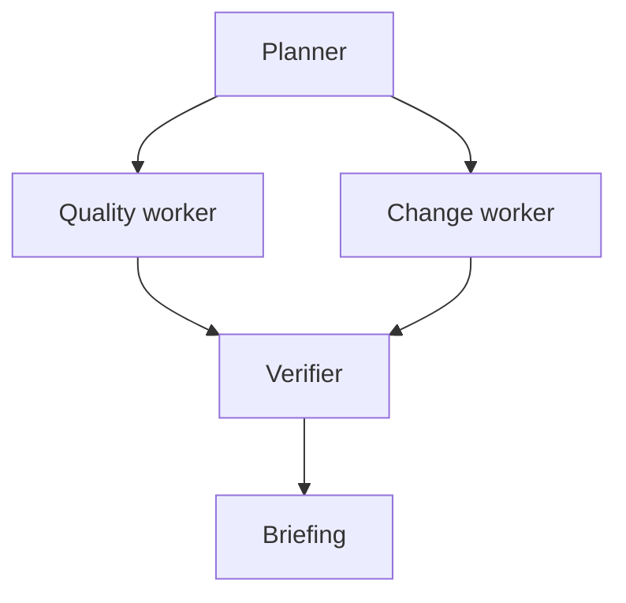
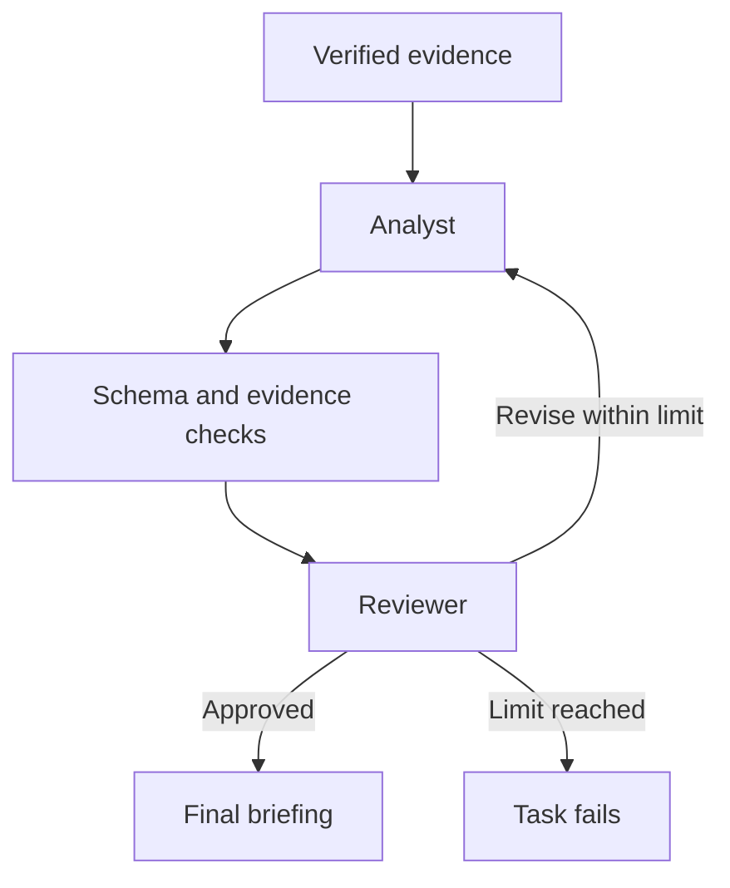

# Architecture

OpsCheck Flow separates a useful deterministic data tool from the orchestration around it. This keeps the workflow inspectable: every data-quality conclusion comes from a rule or a comparison, and optional model recommendations refer to that evidence.

## Modules and boundaries

| Module | Responsibility |
| --- | --- |
| `opscheck/core.py` | CSV parsing, rule validation, data validation, and keyed comparison |
| `opscheck/workflow.py` | Plan, concurrent task scheduling, verification, retries, SQLite state, resume, and run locks |
| `opscheck/agents.py` | Bounded evidence, local chat-completions transport, analyst/reviewer role contexts, JSON validation, and revision loops |
| `opscheck/report.py` | Human-readable summaries and escaped standalone HTML |
| `opscheck/cli.py` | CLI arguments, exit codes, demo resources, destination protection, and report writes |
| `opscheck/examples/` | Bundled synthetic CSV fixtures and a JSON rule set |
| `tests/` | Engine, CLI, workflow/recovery, and model-adapter behavior tests |

The `python -m opscheck` entry point invokes the CLI. Source execution needs no installation, and installed packages include the demo resources.

## Planning and parallel execution

The planner emits a fixed dependency graph. It declares what must finish before each task is eligible to execute; it does not use a model to choose tools dynamically.

`quality_agent` and `change_agent` are independent Python workers scheduled through `ThreadPoolExecutor`. Their names describe responsibilities; they are not model calls. Each produces a structured result. The verifier waits for both and confirms result shape, count consistency, source identity, and equality with a fresh deterministic computation.

The verifier uses the same core engines, so shared engine bugs remain possible. Its purpose is to catch inconsistent outputs and orchestration mistakes, not to act as an independently implemented proof of correctness. Concurrency tests use barriers to establish overlap rather than comparing wall-clock benchmarks.

## Task state and bounded recovery

A task may be `pending`, `running`, `succeeded`, `failed`, or `blocked`. Ready tasks start; a successful task unlocks its dependents. A non-recoverable failure, or a transient failure that exhausts the allowance, blocks downstream tasks while preserving successful independent work.

Retryable failures include explicit demo fault injection and temporary model transport failures. Invalid CSV, invalid rules, malformed model output, or exhausted model review are not fixed by blindly repeating the same operation.

`max_attempts` is limited to 1–5, defaulting to 2. This is an attempt allowance per task for the current invocation. Resume provides another bounded invocation while preserving total lifetime attempts. No retry loop is unbounded and no background scheduler runs after the CLI exits.

Important events include `task_started`, `task_succeeded`, `task_failed`, `task_retrying`, and `task_reused`. Ordered events expose what occurred, including a failed first attempt that was later recovered. Timestamps describe execution history; they are not a performance guarantee.

## Persistence, identity, and locks

The default database is `.opscheck/runs/runs.sqlite3`.

| Table | Stored information |
| --- | --- |
| `runs` | Run ID, configuration, fingerprint, run status, and timestamps |
| `tasks` | Task states, accumulated attempts, errors, and completed outputs |
| `events` | Ordered event history, task IDs, timestamps, and event details |

Run IDs are generated UUID hex strings. Completing each task persists its output and state. Resume skips successful tasks and resets interrupted `running` tasks so they can be attempted again. Failed downstream work can continue after its dependency recovers.

The resume fingerprint includes absolute input paths, file contents, the comparison key, model endpoint/name, and maximum model rounds. Changed source/configuration identity is rejected; start a new run for new exports. Recovery controls such as `max_attempts` and `fail_once` are excluded so they can change on resume without redefining the data being analyzed.

An OS advisory lock prevents concurrent execution of the same run. Locks automatically release when a process exits or crashes. The small `.lock` file remains as an inert marker; its presence does not mean the run is still executing. **Do not delete lock files to recover a run.** Deleting a marker while another process holds its lock can undermine mutual exclusion. Run locking supports POSIX and Windows systems.

SQLite is local state, not distributed coordination. v0.1 does not provide a queue, cross-machine worker leasing, state migrations across future incompatible versions, or an encrypted data store.

## Optional model subagents

Default briefing generation uses code. When a loopback model server is explicitly configured, the briefing step calls an analyst and a reviewer with separate role contexts. They may use the same underlying model; separate contexts do not guarantee independent judgment.

`build_evidence()` preserves aggregate summaries and assigns stable IDs such as `V1` for a validation finding and `C1` for comparison evidence. Schema changes receive comparison evidence too. The adapter considers at most 20 findings per tool, bounds strings and collections, and caps the evidence payload at 64 KiB. Truncation metadata distinguishes a sampled briefing from complete tool totals.

The analyst returns a JSON object with `summary` and `actions`. Every action has a title, a supported priority, and valid evidence IDs. The reviewer returns an approval decision and feedback. Rejection can lead to a revised analyst response; the limit is 1–3 rounds, defaulting to 2. A completed round normally uses two model calls. Transient transport retry can cause the enclosing briefing task to restart within the workflow's attempt limit, so total calls across retries may exceed one review loop.

Malformed envelopes, invalid JSON, unknown evidence IDs, and unacceptable schemas fail the task. Even valid evidence IDs do not establish that prose is correct: an action can cite a real finding and still misinterpret it. Model reviewer approval remains a fallible judgment.

The adapter accepts only an HTTP(S) loopback URL ending in `/v1/chat/completions`. It disables redirects and environment proxy use. Requests have a 30-second timeout; response bodies are limited to 128 KiB. The selected server must understand the chat-completions request format, including JSON-object response format. No model is downloaded automatically. Models have no tool-execution capability in this project.

A fake local HTTP server tests the transport and response-handling behavior. That does not establish compatibility or quality for every real local model server. The initial build did not run a live local model.

## Core engine semantics

CSV decoding accepts UTF-8 and an optional BOM. The loader rejects missing/blank/duplicate headers, malformed rows, width mismatches, files over 10 MiB, and more than 100,000 records. A header-only CSV is valid. Rows are represented as dictionaries of strings; no source data is mutated.

Validation loads a strict versioned JSON schema. It trims outer value whitespace for checks and uses `Decimal` for finite numeric comparisons. Optional blanks skip their rules. Unique fields retain a set of seen nonblank values and report subsequent duplicates. A configured missing column is a schema finding, even when its cells would be optional. Rule findings preserve their original source value and logical CSV record number.

Comparison indexes each snapshot by a unique nonblank trimmed key. Shared non-key values are compared exactly. Changes are recorded once per key, with a list of changed fields; totals count records rather than cells. Added/removed columns are separate schema changes and do not inflate changed-record counts. Keys are sorted for deterministic output.

The engines count every issue/change even if detailed findings are capped. The default cap is 500. This bounds result size, not processing time, and input datasets are still held in memory.

## Reports and exit status

Standalone tools can emit text, JSON, and HTML. Flow commands persist a JSON run report, an HTML workflow report, and tool HTML reports when their results are available. Individual report writes use temporary files and replacement. This does not make all report files a single atomic transaction; an I/O failure may occur after another report was written.

Input/configuration paths are protected against report overwrite, including aliases through symlinks and hardlinks. Distinct requested reports must have distinct destinations. Source values and model text are escaped in HTML. Reports contain source values and should be treated with the same care as their inputs.

Tool status and workflow status answer different questions:

- `validate` fails its data check when findings exist and exits `1`.
- `compare` reports changed records or schema and exits `1`.
- A workflow can succeed with those results because every step executed and verified correctly; it exits `0`.
- Invalid input, execution failure, or I/O error yields CLI exit `2`.

A workflow status of `succeeded` is never permission to apply a business action. v0.1 produces reviewable evidence and briefings; it does not change source records or contact external business services.
