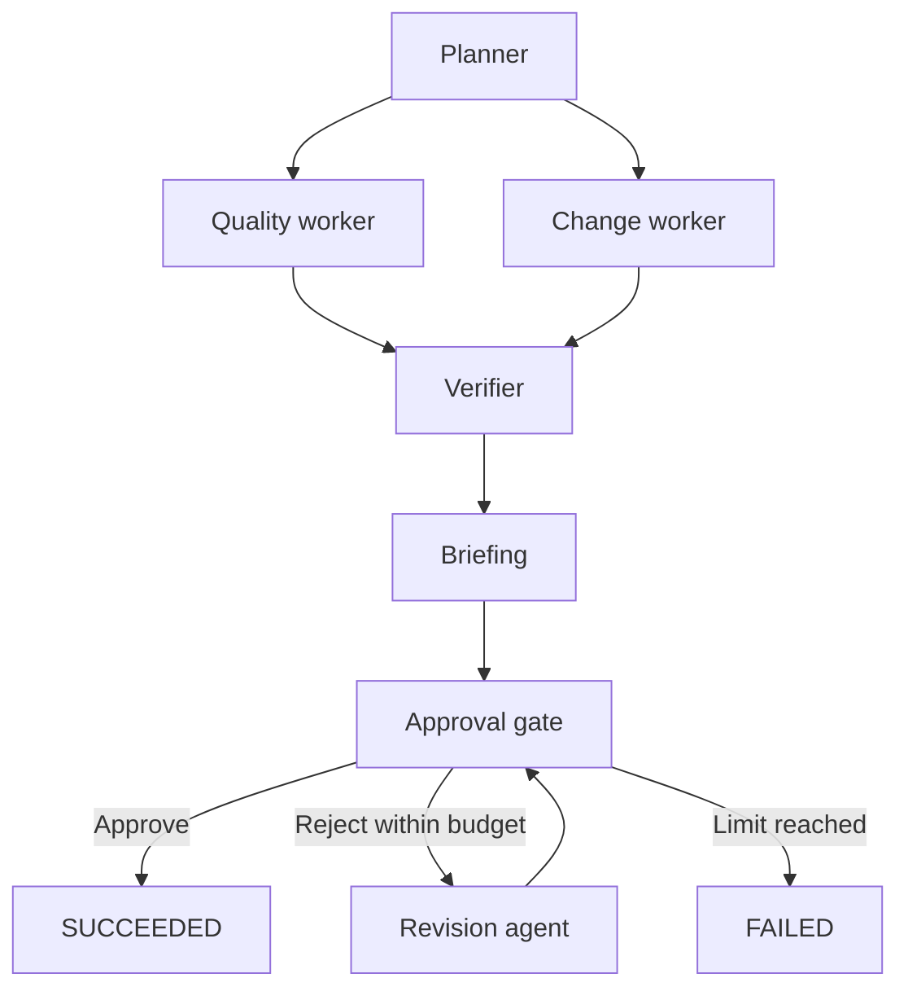
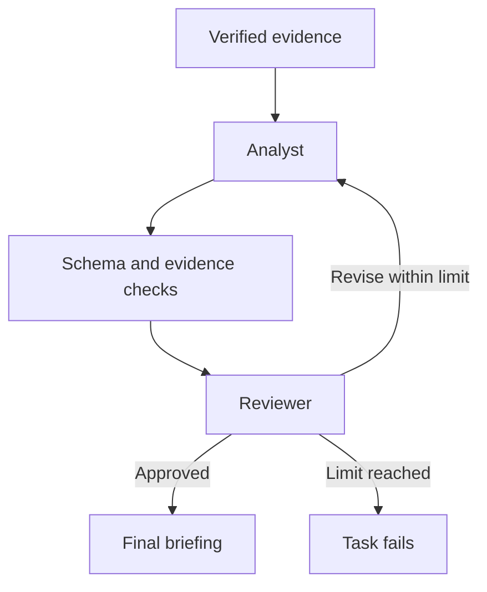
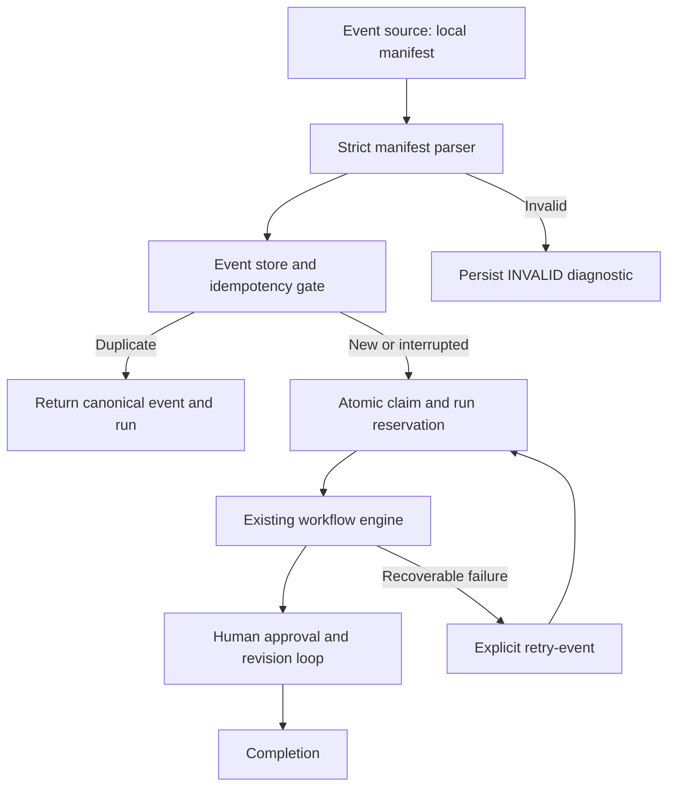

# Architecture

OpsCheck Flow separates a useful deterministic data tool from the orchestration around it. This keeps the workflow inspectable: every data-quality conclusion comes from a rule or a comparison, and optional model recommendations refer to that evidence.

## Modules and boundaries

| Module | Responsibility |
| --- | --- |
| `opscheck/core.py` | CSV parsing, rule validation, data validation, and keyed comparison |
| `opscheck/workflow.py` | Plan, concurrent task scheduling, verification, retries, SQLite state, resume, and run locks |
| `opscheck/manifests.py` | Strict manifest parsing, path containment, source hashes, and event identity |
| `opscheck/event_store.py` | Event schema, SQLite constraints, audit log, and derived workflow status |
| `opscheck/ingestion.py` | Receipt/deduplication, atomic claiming and run reservation, recovery, and one-shot scanning |
| `opscheck/approvals.py` | Approval schema, atomic decisions, durable checkpoints, revision recovery, and inspection |
| `opscheck/revision.py` | Deterministic clarification using verified evidence and human feedback |
| `opscheck/artifacts.py` | Input protection and atomic report replacement under the run lock |
| `opscheck/agents.py` | Bounded evidence, local chat-completions transport, analyst/reviewer role contexts, JSON validation, and revision loops |
| `opscheck/report.py` | Human-readable summaries and escaped standalone HTML |
| `opscheck/cli.py` | CLI arguments, exit codes, demo resources, destination protection, and report writes |
| `opscheck/examples/` | Bundled synthetic CSV fixtures and a JSON rule set |
| `tests/` | Engine, CLI, workflow/recovery, and model-adapter behavior tests |

The `python -m opscheck` entry point invokes the CLI. Source execution needs no installation, and installed packages include the demo resources.

## Planning and parallel execution

The planner emits a fixed dependency graph. It declares what must finish before each task is eligible to execute; it does not use a model to choose tools dynamically.



`quality_agent` and `change_agent` are independent Python workers scheduled through `ThreadPoolExecutor`. Their names describe responsibilities; they are not model calls. Each produces a structured result. The verifier waits for both and confirms result shape, count consistency, source identity, and equality with a fresh deterministic computation.

The verifier uses the same core engines, so shared engine bugs remain possible. Its purpose is to catch inconsistent outputs and orchestration mistakes, not to act as an independently implemented proof of correctness. Concurrency tests use barriers to establish overlap rather than comparing wall-clock benchmarks.

## Task state and bounded recovery

A task may be `pending`, `running`, `succeeded`, `failed`, or `blocked`. Ready tasks start; a successful task unlocks its dependents. A non-recoverable failure, or a transient failure that exhausts the allowance, blocks downstream tasks while preserving successful independent work.

Retryable failures include explicit demo fault injection and temporary model transport failures. Invalid CSV, invalid rules, malformed model output, or exhausted model review are not fixed by blindly repeating the same operation.

`max_attempts` is limited to 1–5, defaulting to 2. This is an attempt allowance per task for the current invocation. Resume provides another bounded invocation while preserving total lifetime attempts. No retry loop is unbounded and no background scheduler runs after the CLI exits.

Important events include `task_started`, `task_succeeded`, `task_failed`, `task_retrying`, and `task_reused`. Ordered events expose what occurred, including a failed first attempt that was later recovered. Timestamps describe execution history; they are not a performance guarantee.

## Persistence, identity, and locks

The default database is `.opscheck/runs/runs.sqlite3`.

| Table | Stored information |
| --- | --- |
| `runs` | Run ID, configuration, fingerprint, explicit run status, failure reason, and timestamps |
| `tasks` | Task states, accumulated attempts, errors, and completed outputs |
| `events` | Ordered event history, task IDs, timestamps, and event details |
| `approvals` | Version, decision, reviewer/comment, timestamps, briefing reference, immutable briefing JSON |

Run IDs are generated UUID hex strings. Completing each task persists its output and state. Resume skips successful tasks and resets interrupted `running` tasks so they can be attempted again. Failed downstream work can continue after its dependency recovers.

The resume fingerprint includes absolute input paths, file contents, the comparison key, model endpoint/name, maximum model rounds, workflow version, and human rejection budget. Changed source/configuration identity is rejected; start a new run for new exports. Recovery controls such as `max_attempts` and `fail_once` are excluded so they can change on resume without redefining the data being analyzed.

An OS advisory lock prevents concurrent execution of the same run. Locks automatically release when a process exits or crashes. The small `.lock` file remains as an inert marker; its presence does not mean the run is still executing. **Do not delete lock files to recover a run.** Deleting a marker while another process holds its lock can undermine mutual exclusion. Run locking supports POSIX and Windows systems.

SQLite is local state, not distributed coordination. v0.1 does not provide a queue, cross-machine worker leasing, or an encrypted data store.

## Optional model subagents

Default briefing generation uses code. When a loopback model server is explicitly configured, the briefing step calls an analyst and a reviewer with separate role contexts. They may use the same underlying model; separate contexts do not guarantee independent judgment.



`build_evidence()` preserves aggregate summaries and assigns stable IDs such as `V1` for a validation finding and `C1` for comparison evidence. Schema changes receive comparison evidence too. The adapter considers at most 20 findings per tool, bounds strings and collections, and caps the evidence payload at 64 KiB. Truncation metadata distinguishes a sampled briefing from complete tool totals.

The analyst returns a JSON object with `summary` and `actions`. Every action has a title, a supported priority, and valid evidence IDs. The reviewer returns an approval decision and feedback. Rejection can lead to a revised analyst response; the limit is 1–3 rounds, defaulting to 2. A completed round normally uses two model calls. Transient transport retry can cause the enclosing briefing task to restart within the workflow's attempt limit, so total calls across retries may exceed one review loop.

Malformed envelopes, invalid JSON, unknown evidence IDs, and unacceptable schemas fail the task. Even valid evidence IDs do not establish that prose is correct: an action can cite a real finding and still misinterpret it. Model reviewer approval remains a fallible judgment.

The adapter accepts only an HTTP(S) loopback URL ending in `/v1/chat/completions`. It disables redirects and environment proxy use. Requests have a 30-second timeout; response bodies are limited to 128 KiB. The selected server must understand the chat-completions request format, including JSON-object response format. No model is downloaded automatically. Models have no tool-execution capability in this project.

A fake local HTTP server tests the transport and response-handling behavior. That does not establish compatibility or quality for every real local model server. The initial build did not run a live local model.

## Core engine semantics

CSV decoding accepts UTF-8 and an optional BOM. The loader rejects missing/blank/duplicate headers, malformed rows, width mismatches, files over 10 MiB, and more than 100,000 records. A header-only CSV is valid. Rows are represented as dictionaries of strings; no source data is mutated.

Validation loads a strict versioned JSON schema. It trims outer value whitespace for checks and uses `Decimal` for finite numeric comparisons. Optional blanks skip their rules. Unique fields retain a set of seen nonblank values and report subsequent duplicates. A configured missing column is a schema finding, even when its cells would be optional. Rule findings preserve their original source value and logical CSV record number.

Comparison indexes each snapshot by a unique nonblank trimmed key. Shared non-key values are compared exactly. Changes are recorded once per key, with a list of changed fields; totals count records rather than cells. Added/removed columns are separate schema changes and do not inflate changed-record counts. Keys are sorted for deterministic output.

The engines count every issue/change even if detailed findings are capped. The default cap is 500. This bounds result size, not processing time, and input datasets are still held in memory.

## Reports and exit status

Standalone tools can emit text, JSON, and HTML. Flow commands persist a JSON run report, an HTML workflow report, and tool HTML reports when their results are available. Individual report writes use temporary files and replacement. This does not make all report files a single atomic transaction; an I/O failure may occur after another report was written.

Input/configuration paths are protected against report overwrite, including aliases through symlinks and hardlinks. Distinct requested reports must have distinct destinations. Source values and model text are escaped in HTML. Reports contain source values and should be treated with the same care as their inputs.

Tool status and workflow status answer different questions:

- `validate` fails its data check when findings exist and exits `1`.
- `compare` reports changed records or schema and exits `1`.
- A workflow can succeed with those results because every step executed, verified correctly, and received human approval; it exits `0`. A durable approval pause also exits `0`.
- Invalid input, execution failure, or I/O error yields CLI exit `2`.

A workflow status of `SUCCEEDED` is never permission to apply a business action. v0.1 produces reviewable evidence and briefings; it does not change source records or contact external business services.

## Durable human decision boundary

`PLAN` retains the existing executable DAG of planner, parallel specialists, verifier, and briefing. The conditional approval/revision state machine follows that DAG rather than pretending a human decision is a worker future. `approval_gate` is recorded as a task with `waiting`, `succeeded`, or `failed` status. Each attempted revision has its own `revision_agent_N` task record. The public plan includes both conditional roles.

Run state uses `PENDING`, `RUNNING`, `WAITING_FOR_APPROVAL`, `SUCCEEDED`, and `FAILED`; task state remains lowercase. New runs are created pending and transition to running before execution. Completed workers no longer finalize a run. After the briefing output commits, the approval state machine atomically inserts the pending approval and its exact briefing JSON, records `approval_requested` and `workflow_paused`, and sets the run waiting. No terminal input loop or background process remains.

An approval decision transaction updates only the observed pending ID using a conditional update. The same transaction stores the decision, identity, comment, timestamp, `approval_approved`/`approval_rejected`, `workflow_resumed`, and the run's `RUNNING` state. Approval then marks the gate and run successful. Rejection starts a focused deterministic revision against saved worker/verifier evidence and the rejected briefing. Its output commits before the next approval request is inserted.

Crash boundaries are deliberate:

| Last committed state | Recovery |
| --- | --- |
| Briefing completed, no request | Create the first pending request |
| Pending request | Leave waiting; ordinary resume cannot approve |
| Approved decision, run running | Finalize success without rerunning specialists |
| Rejected decision, revision not completed | Execute or retry that revision |
| Revision output saved, next request absent | Reuse the saved output and request the next approval |
| Decision committed, report write failed | Regenerate reports from SQLite using `resume` |

The default `max_human_revisions=3` means a maximum of three rejected versions, including the original. The third rejection fails the gate/run, persists a clear failure reason and `revision_limit_reached`, and creates no further request. This failure is terminal across resume. A revision execution error is saved separately and can be retried with resume. Normal worker retries remain bounded per invocation and independent of the human rejection budget and optional model review budget.

`revision_started` and `revision_completed` events include task, iteration, and approval ID. Each successful revision retains the original summary, records feedback, orders validation or change detail first, and includes exact saved finding samples with aggregate totals and sampling disclosures. It does not revalidate changed source files, invent missing records, perform source repairs, or call an external service. A model-generated original briefing retains its original model review history; the new revision metadata explicitly identifies deterministic local revision.

## Approval transactions and concurrency

SQLite `BEGIN IMMEDIATE` serializes schema migration and decision writes. A partial unique index allows only one pending approval per run; `(run_id, iteration)` is unique. Triggers prevent changing resolved decisions, changing briefing identity/content, or deleting approval history through ordinary SQL. A local database owner can still alter the schema; this is not a tamper-proof compliance store.

The existing OS run lock spans decision execution, revision computation, and report regeneration. It prevents two processes from writing competing reports or executing the same revision. Before taking this lock, a decision snapshots the current pending ID; the transaction must still match that exact ID and pending status. `--approval-id` additionally lets a delayed client bind a decision to the version actually reviewed. Without an explicit ID a newly started command intentionally observes the currently pending version. A losing concurrent command fails cleanly; it never redirects an observed old decision onto a new version.

All SQLite connections close in `finally` blocks; a connection's transaction context alone is insufficient. Reports are rendered from committed state and replaced atomically per file while holding the run lock. They are not a transaction across all files. `inspect_run` reads a SQLite snapshot and does not trust reports. Individual approval snapshots remain in SQLite even if all report files are deleted.

## Existing database compatibility

Opening a Milestone 1 database adds the approval table/indexes/triggers and nullable failure reason, and normalizes run statuses to uppercase without changing task evidence. Legacy fingerprint verification continues to use the saved version-1 configuration. Already completed historical runs remain completed and do not gain fabricated approvals. An unfinished legacy run gains the approval gate after completing its briefing, with the default three-rejection budget. No general migration framework for future incompatible schemas is claimed.

Human reviewer names are asserted local metadata, not authenticated accounts. SQLite and locks coordinate one local filesystem; network filesystem and distributed operation are not supported. HTML escapes human comments, reviewer names, source evidence, and failure reasons. The optional model reviewer remains a separate boundary and can never grant human approval.

## Event-triggered ingestion



The synchronous ingestion loop receives, validates, fingerprints, persists, claims, executes, and inspects the outcome. Each transition has durable evidence. Waiting for human approval stops processing normally; invalid jobs stop with diagnostics; duplicates reuse canonical state; failed jobs require an explicit retry. A one-shot scan repeats this loop for each eligible manifest and isolates individual failures. Milestone 4 adds a separate queue and optional worker loop; it does not add an inbox watch loop.

### Event identity and schema

`ingestion_events` stores a generated internal `evt_...` ID, first external ID, first manifest path, normalized manifest JSON, fingerprint, expected workflow fingerprint, saved workflow configuration, lifecycle status, error/retryability, duplicate/claim counters, timestamps, and a unique reserved run ID. Invalid events have no workflow ID. The reserved ID deliberately has no foreign key to `runs`, because reservation must commit **before** that run exists.

`external_event_ids` binds each explicit external ID to one canonical event and fingerprint. Several external IDs may name identical content; each alias remains bound to that content. `ingestion_event_log` records receipt, validation, duplicates, claims, reservation, workflow creation, waiting, completion, failure, invalidity, and retries. Duplicate submissions increment the canonical counter and append their own path/alias to the log; there is no separate DUPLICATE lifecycle row.

The canonical content fingerprint hashes sorted JSON with format version 1, event type, normalized key, and content hashes keyed by `input`, `rules`, `before`, and `after`. No time, UUID, manifest name, source path, or external ID participates. Source role matters. Rule bytes matter, even when a formatting-only edit has equivalent rule meaning. Unknown manifest settings cannot silently alter workflow execution because the parser rejects them.

Uniqueness is enforced by the canonical identity key, a partial unique fingerprint index excluding INVALID diagnostics, unique external-ID bindings, and unique reserved run IDs. Identity/reservation triggers reject changes to the original content identity, saved execution configuration, expected workflow fingerprint, or an assigned run ID. `runs.run_id` remains the engine's primary key. UUIDs label records and reservations; they are never used as the idempotency fingerprint.

### Lifecycle and transactions

```text
RECEIVED -> VALIDATED -> CLAIMED -> WORKFLOW_CREATED
                                          |
                        +-----------------+-----------------+
                        v                 v                 v
               WAITING_FOR_APPROVAL   COMPLETED           FAILED
                        |                                   |
                  human decision                  explicit recoverable retry
                        |                                   |
                 workflow resumes <---------------------- CLAIMED

Validation/conflict failure -> INVALID (terminal diagnostic)
```

Strict parsing, path resolution, and input hashing occur before the receipt transaction. A valid canonical receipt logs RECEIVED and VALIDATED in one transaction; these timestamps/audit entries persist before any claim. An explicit-ID conflict is recorded as INVALID in that same serialized identity check. This avoids partial external-ID bindings.

A process first obtains an OS-owned event lock and then performs a SQLite compare-and-set claim under `BEGIN IMMEDIATE`. It checks the observed lifecycle state and claim generation, increments the claim counter, and assigns a run ID only if none is reserved. The claim and reservation audit entries commit in that transaction. No other process can atomically reserve a second run. The event lock is held across execution and report generation; the workflow engine independently uses its existing run lock.

An OS lock held by a live process prevents recovery from stealing a slow claim. After a process exits or crashes, the OS releases its lock, allowing the same saved claim to be recovered without an arbitrary lease expiration. SQLite CAS and uniqueness provide the durable state boundary; the lock establishes which local process may execute/recover that boundary. Lock files remain as inert markers and must not be deleted to unlock live work.

The new reserved-run entry parameters extend `run_workflow` without changing ordinary run/resume calls. The engine verifies the durable reservation and expected fingerprint. If the reserved ID already exists it resumes that run; otherwise it creates exactly that ID. It never allocates a substitute ID after a crash. Once a briefing exists, ingestion delegates to the existing approval-aware `resume_run` so revision history and saved verifier evidence remain authoritative.

### Input identity across ingestion and execution

Input content is hashed while resolving the manifest. Those same hashes construct both the path-independent event fingerprint and the existing path/configuration-bound workflow fingerprint. The expected workflow fingerprint is persisted at receipt. The engine compares newly read source hashes against that expectation before creating the reserved run; it does not silently update event identity when a source changes. Its existing verifier also checks for source changes during execution.

A failed event can be retried after restoring original input bytes. Changed content normally represents a different fingerprint, but reusing an explicit external ID with changed content is always a conflict. A verified briefing is a later durable boundary: its revision recovery uses saved evidence and does not require the source files to remain present.

### Synchronization and recovery

Workflow status is authoritative: PENDING/RUNNING maps to WORKFLOW_CREATED, WAITING_FOR_APPROVAL maps directly, SUCCEEDED maps to COMPLETED, and FAILED maps directly. Status synchronization runs when workflow reports are rebuilt, an individual run/event is inspected, events are listed, or an existing event is revisited. It records workflow creation once even after a crash before the ingestion process saved its outcome. A precreation failure, or inability to resume an interrupted run, remains an ingestion failure until retry succeeds. Repeated inspection does not duplicate transition events or reset completion timestamps.

| Last durable boundary | Recovery behavior |
| --- | --- |
| Event persisted, no claim | Re-ingest/scan claims the canonical event |
| Claim and run reservation committed, run absent | Reuse the reserved ID and create that run |
| Run created, task execution interrupted | Resume the same run with saved successful task outputs |
| Briefing waiting, ingestion outcome stale | Synchronize to WAITING_FOR_APPROVAL; do not bypass approval |
| Human decision committed, workflow incomplete | Resume the existing approval/revision transition |
| Workflow succeeded, event outcome stale | Inspection synchronizes COMPLETED and records it once |
| Recoverable ingestion/workflow failure | retry-event reuses the reservation and approval history |
| INVALID or human revision budget exhausted | Stop; retry cannot reset the decision boundary |

Retry allowance for worker execution remains bounded per invocation. Repeated scans do not automatically retry FAILED events. Retry of a waiting/completed/invalid event returns a clean error. A resumed event cannot create a second workflow or clear previous approvals. Invalid replays use a stable diagnostic key based on path, error, and a bounded raw-content hash; malformed JSON is not stored as executable or trusted configuration. Oversized malformed files use the first 65,537 bytes for that diagnostic hash. An unwritable/unsafe state destination may prevent recording the diagnostic; source protection takes priority.

### Security and operating scope

Manifest sources must resolve to regular files within the manifest directory; platform drive paths, absolute paths, alternate data streams, and symlink traversal outside the directory are rejected. Only recognized manifest fields are retained in invalid diagnostics. JSON is never evaluated and cannot select dynamic imports or services. Input aliases, SQLite files and sidecars, and run/event lock files remain protected. Event metadata is HTML escaped and arbitrary manifest-derived text is quoted or JSON escaped in the CLI.

The design provides **at-most-one canonical workflow per event fingerprint within a shared local SQLite state store**. Separate stores, independent machines, network filesystems, malicious database modifications, authenticated event production, and distributed exactly-once delivery are outside this guarantee. Connections are owned and explicitly closed in `finally` blocks, including initialization and failure paths. Reports remain disposable per-file atomic replacements derived from SQLite, not the source of ingestion history.


## Durable worker queue

```text
Event -> Idempotency -> Queue -> Lease -> Worker -> Workflow -> Human Approval -> Completion

QUEUED --eligible claim--> LEASED
LEASED --workflow checkpoint--> WAITING_FOR_APPROVAL
LEASED --workflow success--> SUCCEEDED
LEASED --recoverable error, budget remains--> QUEUED (backoff)
LEASED --run/event busy--> QUEUED (1-second defer; budget refunded)
LEASED --expired lease, budget remains--> QUEUED (immediately reclaimable)
LEASED --exhausted budget or terminal identity failure--> DEAD_LETTER
WAITING_FOR_APPROVAL --reject/revise--> WAITING_FOR_APPROVAL
WAITING_FOR_APPROVAL --approve--> SUCCEEDED
WAITING_FOR_APPROVAL --recoverable revision failure--> QUEUED or DEAD_LETTER (budget)
WAITING_FOR_APPROVAL --human revision limit--> DEAD_LETTER (non-replayable)
DEAD_LETTER --explicit replay, if replayable--> QUEUED (new budget)
```

### Storage and the reservation bridge

`queue_jobs` has unique event and reserved run IDs, immutable job/event/run identity, bounded priority and retry settings, lifetime and current-budget attempt counts, UTC availability/lease timestamps, owner/token, failure metadata, replayability, and replay count. An insertion trigger requires the existing event reservation to match the job. No run foreign key is imposed before execution because enqueue deliberately does not insert a workflow or tasks.

`queue_attempts` retains lifetime attempt number, replay generation, worker ID, private lease token, start/heartbeat/finish timestamps, outcome, error, and lease-loss evidence. Identity fields are immutable. `queue_events` records creation, claiming, start, failures, requeue/deferral, expiration, checkpoint, completion, dead-letter, replay, lost lease, and delivery warnings. Heartbeat renewal updates the attempt timestamp instead of appending unbounded audit spam. CLI inspection omits tokens.

`ingestion.receive` shares Milestone 3 parsing, source containment, content identity, alias/conflict handling, and durable receipt without execution. After receipt, enqueue uses `BEGIN IMMEDIATE` to reserve a run and create its one queue job in a single transaction. A crash before that commit leaves a receipt recoverable by another enqueue; after commit the reservation and job are both durable. `ingestion.reserve` is also used by synchronous claims and reads the current reservation under the write transaction, so even a claim that observed the event before enqueue cannot replace the saved ID. Duplicate enqueue preserves the first job's priority and budget.

### Claim, heartbeat, and fencing

A claim takes `BEGIN IMMEDIATE`, reconciles committed workflow checkpoints, and resolves expired leases. It records each expired attempt, requeues immediately if budget remains, or dead-letters at the limit. It then selects one eligible QUEUED job by highest priority, earliest availability, creation time, and ID. Eligibility is refreshed after expiry processing so clock advancement within the transaction does not postpone the recovered job. Claiming writes LEASED, `secrets.token_hex(32)`, owner, expiry, start time, incremented lifetime/budget counts, and the attempt/audit records before committing.

Heartbeat and result settlement acquire a write transaction, require matching job ID and token, status LEASED, and an expiry strictly later than now. Ownership reads and updates remain in that same serialized transaction. Stale or expired tokens cannot renew, complete, fail, requeue, or dead-letter a job. A rejected token can only mark its own attempt's lease-loss evidence once. Renewal cannot move expiry backward. Tokens are internal fencing values; worker names are asserted diagnostic metadata.

A worker starts a non-daemon heartbeat thread and renews every lease_seconds/3, using separately owned SQLite connections closed after each renewal. If renewal fails, the worker records the local loss and refuses result settlement. Already running Python computation is not forcibly killed. The existing event lock and workflow run lock span actual execution/recovery; they prevent a new lease holder from concurrently mutating the same workflow. A competing worker gets RunBusyError and safely defers, keeping an auditable lifetime attempt but refunding that deferral's budget charge. Ctrl+C joins the heartbeat and requeues an owned interrupted delivery. Process death releases the OS locks; the lease remains durable until expiration/reconciliation.

### Workflow authority and recovery

`worker._execute` calls the existing ingestion recovery entry point with explicit busy propagation and delivery retry behavior. It does not reimplement agents, verification, retry, approval, or revision. It checks reserved identity and supported saved workflow configuration before starting. Completed tasks remain saved; an incomplete task may legitimately repeat after a crash. Once a briefing exists, the existing approval-aware resume path uses its saved evidence even if source files moved.

Queue publication synchronization skips LEASED jobs: only their token holder can settle delivery through the worker API. Queue inspection and the next claim may independently reconcile a committed WAITING_FOR_APPROVAL/SUCCEEDED workflow after a crash before settlement, clearing the lease and finishing its attempt. This operation derives exclusively from SQLite workflow facts, not a supplied worker result. It may also retire a live lease whose workflow has already durably reached its checkpoint; that worker then observes lease loss rather than overwriting the reconciled state.

Released queue jobs synchronize during workflow/event publication and inspection. Approval updates queue SUCCEEDED and event COMPLETED; rejection/revision normally leaves the same queue job waiting with the same delivery count. Interrupted human transitions still support explicit existing `resume`. Recoverable revision failures use queue retry/dead-letter policy; human revision-limit failures are permanently non-replayable. Replaying a delivery never resets human revision limits or immutable approval history.

Reports are disposable. After settlement the worker refreshes compact queue metadata under the existing run lock without executing workflow tasks. A report I/O error returns an error but cannot undo a committed approval checkpoint or create another run; a delivery-warning audit entry retains publication failure evidence. Inspection/explicit resume can recover or regenerate artifacts.

### Delivery budgets and operational scope

Failures use 1, 2, 4, 8... second deterministic backoff, capped at 60 seconds. `max_attempts` is 1–10 per delivery budget; `budget_attempts` counts toward that limit and `attempts` counts lifetime claims. Expired attempts consume budget. Expected lock deferrals refund only their budget charge. Exhaustion records DEAD_LETTER, error type/message, timestamp, and audit evidence. Replay is allowed only for replayable dead letters, increments replay_count, resets budget_attempts, and optionally changes max_attempts while retaining all identities/history. Unsupported immutable execution identity and human revision exhaustion refuse replay. CSV business findings are not delivery errors.

Synchronous ingest and enqueue share the same canonical event and reservation in either order. Enqueue after a completed or paused synchronous run simply reflects that workflow without rerunning it. Explicit synchronous ingest/retry/resume remains available even for queued events; queue budgets bound automatic worker deliveries, not authorized manual workflow operations.

Long-running mode polls rather than busy-spinning when empty. `--max-jobs` counts successful claims, including failures/deferrals, and keeps waiting if the queue has fewer eligible jobs. `--once` takes precedence. CLI exit codes and runnable PowerShell demos are documented in README. Demo failure injection is a worker CLI flag only, never a manifest field or executable hook.

All state writes reuse existing SQLite/sidecar/source protection. Manifest values never select code, SQL identifiers, executable commands, or output links. Queue HTML and CLI metadata are escaped. Connections close explicitly on success, failure, initialization error, and heartbeat paths. Schema additions preserve existing Milestone 1–3 tables and behavior. This is durable local multi-process queue coordination using one shared SQLite state store and local OS locks, with a sufficiently consistent local clock. Network filesystems, independent machines, distributed consensus, global exactly-once processing, and an external network queue are not supported.
